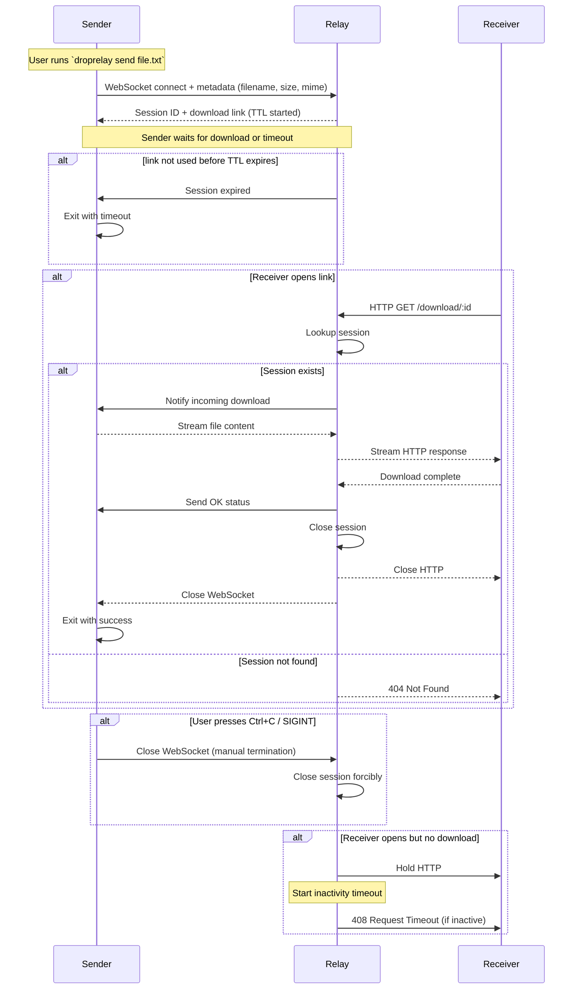

# Send flow

User runs `droprelay send file.txt` and share the link with the receiver. 

```mermaid
sequenceDiagram
    participant Sender
    participant Relay
    participant Receiver

    Note over Sender: User runs `droprelay send file.txt`

    Sender->>Relay: WebSocket connect + metadata (filename, size, mime)
    Relay-->>Sender: Session ID + download link (TTL started)

    Note over Sender, Relay: Sender waits for download or timeout

    alt link not used before TTL expires
        Relay->>Sender: Session expired
        Sender->>Sender: Exit with timeout
    end

    alt Receiver opens link
        Receiver->>Relay: HTTP GET /download/:id
        Relay->>Relay: Lookup session

        alt Session exists
            Relay->>Sender: Notify incoming download
            Sender-->>Relay: Stream file content
            Relay-->>Receiver: Stream HTTP response

            Receiver-->>Relay: Download complete
            Relay->>Sender: Send OK status
            Relay->>Relay: Close session
            Relay-->>Receiver: Close HTTP
            Relay-->>Sender: Close WebSocket
            Sender->>Sender: Exit with success
        else Session not found
            Relay-->>Receiver: 404 Not Found
        end
    end

    alt User presses Ctrl+C / SIGINT
        Sender->>Relay: Close WebSocket (manual termination)
        Relay->>Relay: Close session forcibly
    end

    alt Receiver opens but no download
        Relay->>Receiver: Hold HTTP
        Note over Relay: Start inactivity timeout
        Relay->>Receiver: 408 Request Timeout (if inactive)
    end
```
